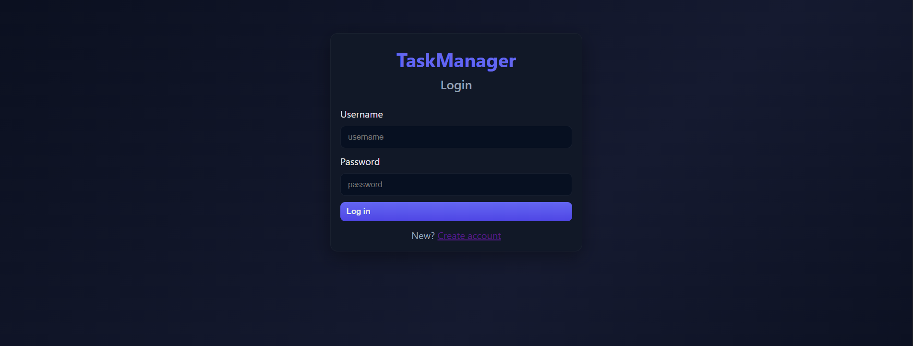
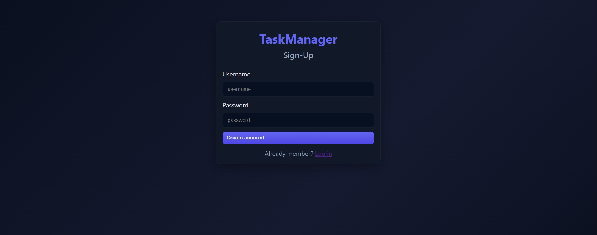
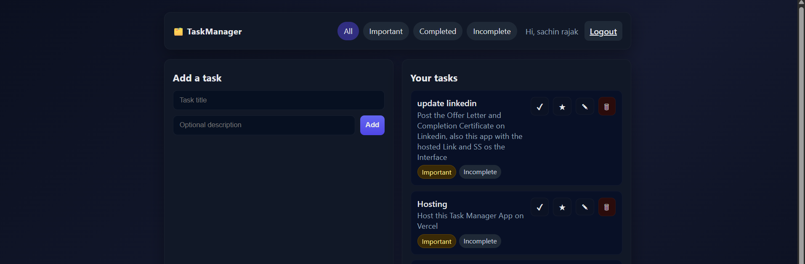

# 📝 TaskManager

A simple and efficient Task Management Web App built using Flask (Python), MongoDB, and HTML/CSS/JS.

## 🚀 Overview

TaskManager helps users efficiently organize their daily tasks. It features user authentication, task creation, editing, deletion, and smart filtering. The app offers a clean interface and seamless data storage powered by MongoDB.

## ⚙️ Features

- 🔐 **Authentication** – Secure user signup and login using hashed passwords
- ➕ **Add Task** – Easily add tasks with titles and descriptions
- 🗂️ **Filter Tasks** – View tasks by categories:
  - **All Tasks** (includes Add Task option)
  - **Important Tasks**
  - **Completed Tasks**
  - **Incomplete Tasks**
- 🧩 **Edit & Delete** – Update or remove any task instantly
- 💾 **Persistent Storage** – Tasks and users stored in MongoDB
- 🎨 **Responsive UI** – Simple, minimal, and modern dark-themed layout for better usability

## 🛠️ Tech Stack

- **Frontend:** HTML, CSS, JavaScript
- **Backend:** Flask (Python)
- **Database:** MongoDB
- **Security:** Werkzeug password hashing

## 📂 Project Structure

```
TaskManager/
│── app.py                 # Main Flask application
│── models/
│   ├── user_model.py      # User model helpers
│   └── task_model.py      # Task model helpers
│── templates/
│   ├── login.html         # Login page
│   ├── signup.html        # Signup page
│   └── tasks.html         # Main task dashboard
│── static/
│   ├── style.css          # Styling
│   └── script.js          # Frontend logic
│── README.md
```

## ⚡ Setup Instructions

1. **Clone or download the repository**
   ```bash
   git clone https://github.com/Sachin-2011/TaskManager.git
   cd TaskManager
   ```

2. **Install dependencies**
   ```bash
   pip install flask flask-pymongo werkzeug
   ```

3. **Start MongoDB locally**
   - Make sure MongoDB is running on `mongodb://127.0.0.1:27017/`
   - Or update the connection string in `app.py` to connect to your MongoDB Atlas cluster

4. **Run the Flask app**
   ```bash
   python app.py
   ```

5. **Visit** `http://localhost:5000` in your browser

## 📸 Screenshots

### Login Page


### Sign-Up Page


### Task Dashboard


## 💡 Future Enhancements

- 📅 Add due dates and task reminders
- 🌙 Dark mode toggle
- 👥 Multi-user collaboration features
- 🔔 Push notifications for important tasks
- 📊 Task analytics and productivity insights
- 📱 Mobile app version

## 👨‍💻 Author

**Sachin Rajak**
- GitHub: [@Sachin-2011](https://github.com/Sachin-2011)

## 📄 License

This project is open source and available for learning purposes.

---

⭐ If you found this project helpful, please give it a star!